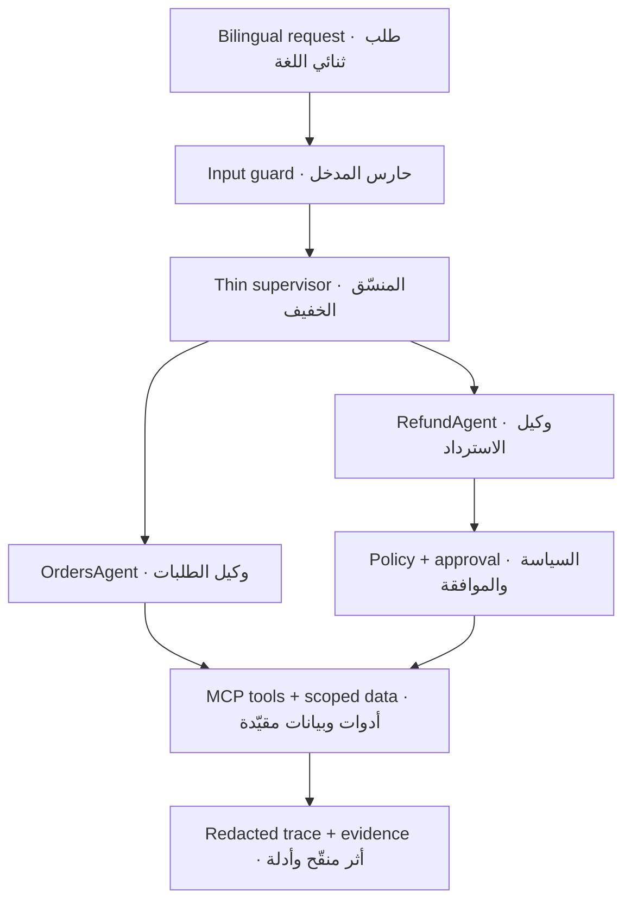

# Rafeeq Mini · رفيق ميني

[](CHANGELOG.md)
[](https://colab.research.google.com/github/Mrsos07/rafeeq-mini-lab--saud-alghamdi-Sadaia/blob/main/notebooks/Rafeeq_Mini_Capstone.ipynb)
[](#)
[](#)

مساعد عمليات وكيلي ثنائي اللغة (عربي/إنجليزي) لشركة توصيل افتراضية، مبني كنظام ذكاء اصطناعي توكيلي آمن وقابل للتدقيق: حالة مُنمّطة، ذاكرة معزولة، تنسيق بين وكلاء متخصصين، حواجز أمان، وتتبّع منقّح.

A bilingual (AR/EN) agentic-AI operations assistant for a fictional delivery company, built as a safe, auditable agentic system: typed state, scoped memory, specialist orchestration, safety guardrails, and redacted tracing.

---

## نظرة عامة · Overview

يفهم **رفيق ميني** طلب العميل بالعربية أو الإنجليزية، ويتحقق من ملكية الطلب، ويسترجع السياسة السارية، ثم يوجّه المهمة إلى الوكيل المتخصص. يتوقف أي استرداد يتجاوز **500 ريال** لموافقة بشرية موثّقة، وتُسجَّل كل خطوة في أثر منقّح قابل للتدقيق. يعمل المشروع بنمط حتمي غير متصل (`LLM_MODE=stub`) بلا مفتاح API وبلا بيانات حقيقية.

Rafeeq Mini reads a customer request in Arabic or English, verifies order ownership, retrieves the active policy, and routes the task to a specialist agent. Refunds above **SAR 500** pause for documented human approval, and every step is recorded in a redacted, auditable trace. It runs fully offline and deterministically (`LLM_MODE=stub`) with no API key and no real data.

## الخصائص · Features

- **حالة مُنمّطة** · Typed state — عقد `TypedState` صريح يُبنى من أحداث الأدوات فقط.
- **تدفق محدود** · Bounded ReAct — دورة تشغيلية بأربع مراحل مع ميزانيات `6/12/2/1` وإيقاف آمن.
- **ذاكرة معزولة** · Scoped memory — استرجاع مفلتر بالمالك والنشاط والصلاحية قبل الترتيب.
- **استرجاع السياسة** · Active-policy retrieval — إرجاع الإصدار الساري فقط.
- **وكلاء متخصصون** · Specialist agents — وكيلا الطلبات والاسترداد مع منسّق وتفويض مُنمّط.
- **موافقة بشرية** · Human-in-the-loop — استرداد فوق 500 ريال يتوقف للموافقة ويُستأنف بأمان.
- **أدوات MCP** · MCP tools — خادم/عميل `stdio` محلي بعقد أداة صريح.
- **حواجز أمان** · Guardrails — كشف حقن الأوامر، منع التكرار، وعزل بيانات العملاء.
- **تتبّع منقّح** · Redacted tracing — 214 حدث قرار بدون أسرار أو بيانات عملاء.
- **تحسين محمي** · Guarded optimization — `current_policy_cache` بمفتاح يستبعد بيانات العملاء.

## المعمارية · Architecture



| المكوّن · Component | المسؤولية · Responsibility |
|---|---|
| `src/rafeeq/state` | الحالة المُنمّطة واللقطة الآمنة |
| `src/rafeeq/graph` | الرسم المحدود ودورة ReAct والإيقاف الآمن |
| `src/rafeeq/agents` | وكيلا الطلبات والاسترداد + المنسّق والتفويض |
| `src/rafeeq/memory` | ذاكرة الجلسة والاسترجاع حسب العميل |
| `src/rafeeq/retrieval` | استرجاع السياسة السارية (TF-IDF + Cosine) |
| `src/rafeeq/guards` | حواجز الإدخال والإخراج والموافقة |
| `src/rafeeq/tracing` | التتبّع المنقّح والتقييم |
| `mcp_server/` | خادم MCP تعليمي عبر `stdio` بلا اعتماديات |

## التشغيل · Run

المسار الأساسي يعمل على Colab Free CPU وبلا تثبيت:

```bash
python scripts/doctor.py                    # فحص البيئة → C0 = READY
python -m unittest discover -s tests/public -p "test_*.py" -v   # الاختبارات العامة
python scripts/run_assessment.py            # التقييم النهائي
python scripts/validate_submission.py       # التحقق من التسليم
```

## المخرجات · Outputs

| الملف · File | الغرض · Purpose |
|---|---|
| `reports/assessment_results.json` | نتائج التقييم: 8/8 وظيفي · 8/8 أمني · 11/11 بوابة حرجة |
| `reports/SECURITY_ASSESSMENT.md` | التقييم الأمني وإعادة الاختبار (L-SEC-09) |
| `reports/PROJECT_REPORT.md` | تقرير المشروع |
| `reports/trace.jsonl` | أثر تنفيذ منقّح (214 حدثاً) |
| `reports/monitoring_dashboard.png` | لوحة مراقبة |
| `reports/submission_manifest.json` | بيان ملفات التسليم |

## هيكل المستودع · Repository structure

| المسار · Path | الغرض · Purpose |
|---|---|
| `src/rafeeq/` | النواة البرمجية (حالة، رسم، وكلاء، ذاكرة، حواجز، تتبّع) |
| `mcp_server/` | خادم MCP محلي عبر `stdio` |
| `data/public/` | بيانات اصطناعية عامة بإصدار محدّد |
| `tests/public/` | اختبارات العقود والسلامة |
| `scripts/` | الفاحص والبوابات والتقييم والتحقق |
| `notebooks/` | الدفتر التراكمي (C0–C29) |
| `reports/` | الأدلة والتقارير والمخرجات |

## الأمان · Safety

- Synthetic data only — بيانات اصطناعية بالكامل — لا اتصال بأي نظام توصيل أو دفع أو عملاء حقيقيين.
- الهوية الموثوقة وسياق الموافقة يُضافان من المضيف، لا من وسائط يتحكم بها النموذج.
- الآثار تسجّل القرارات والعدادات فقط — لا أوامر خام ولا سلسلة تفكير خاصة.
- عمليات الكتابة لا تُعاد تلقائياً، والقراءة لها إعادة واحدة محدودة.

---

مشروع تعليمي ضمن برنامج **هندسة أنظمة الذكاء الاصطناعي التوكيلي المتقدمة** — [أكاديمية سدايا على GitHub](https://github.com/SDAIAAcademy). محاكاة تعليمية فقط، ليست نشراً إنتاجياً.

Educational project for the **Advanced Agentic AI Systems Engineering** program — [SDAIA Academy on GitHub](https://github.com/SDAIAAcademy). Training simulation only, not a production deployment.
